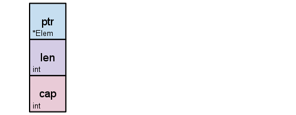

# Daily Knowledge

## Day 1

### Slices

- The `slice` type is an abstraction built on top of Go’s `array` type
- A **slice** is a descriptor of an array segment. It consists of

  - **Pointer** to the array.
  - **Length**
  - **Capacity**
  <p align="center"></p>

- The **length** of a slice is the number of elements it contains.
- The **capacity** of a slice is the number of elements in the underlying array, _counting from the first element in the slice_.
  - The length and capacity of a slice `s` can be obtained using the expressions `len(s)` and `cap(s)`.

```go
// When the capacity argument is omitted, it defaults to the specified length.
s := make([]byte, 5, 5) //  s=[0,0,0,0,0]
len(s) == 5 // True
cap(s) == 5 // True
```

<p align="center"></p>

- Now, let slice s by `s=s[2:4]`, observe the changes in the slice `s`, where the pointer now is moved to the third position in the underlying array, the length is 2, and capacity reduces to 3 only as counting from the first element in the slice which is from the third position

```go
s = s[2:4]  // s = [0,0]
len(s) == 2 // True
cap(s) == 3 // True
```

<p align="center"></p>

- We can grow s to its capacity by slicing it again

```go
s = s[:cap(s)] // s = [0,0,0]
```

<p align="center"></p>

- A slice cannot be grown beyond its capacity. Attempting to do so will cause a runtime panic

#### Appending to Slice

- It is common to append new elements to a slice, and so Go provides a built-in `append` function.
- If the underlying array of `s` is too small to fit all the given values a bigger array will be allocated. The returned slice will point to the **newly allocated array**.

```go
var s []int
s = append(s, 1)        // [1]
s = append(s, 2, 3, 4)  // [1,2,3,4]
```

- To append one slice to another, use `...` to expand the second argument to a list of arguments.

```go
a := []string{"John", "Paul"}
b := []string{"George", "Ringo", "Pete"}
a = append(a, b...) // equivalent to "append(a, b[0], b[1], b[2])"
```

### Array

- `[...]` to let the compiler count the array elements

```go
// let the compiler count the element for you
b := [...]string{"Penn", "Teller"} // in this case, will be [2]string
```
