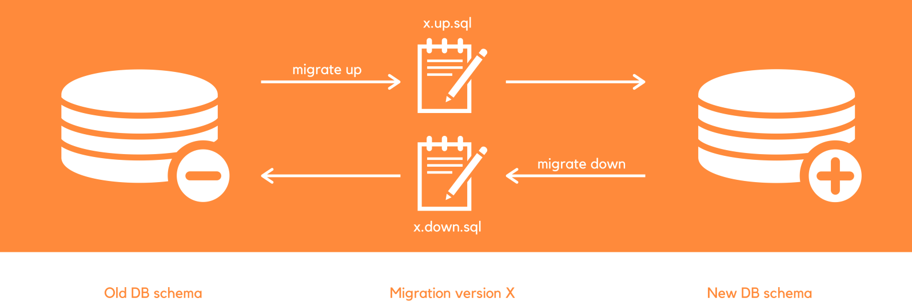

# Database Migration

## Installation

- [Go Migrate](https://github.com/golang-migrate/) with [CLI Installation](https://github.com/golang-migrate/migrate/tree/master/cmd/migrate)
- Install Go Migrate CLI

```Shell
brew install golang-migrate

# check if golang-migrate is installed properly
migrate --version
migrate -help # to read manual
```

## Command

| Command    | Description                   |
| ---------- | ----------------------------- |
| `create`   | create a new migration file   |
| `goto V`   | migrate to a specific version |
| `up [N]`   | migrate to a specific version |
| `down [N]` | migrate to a specific version |

- `migrate create` this will create up and down scripts

  - For example: `migrate create -ext sql -dir db/migration -seq init_schema`

    - `-ext sql` extension will be `sql`
    - `-dir` directory where to store migration file
    - `-seq` sequence of migration, in this case is `init_schema`
    - Returns:

    ```Shell
    # up script
    /Users/codexplore/Developer/repos/simplebank/db/migration/000001_init_schema.up.sql
    # down script
    /Users/codexplore/Developer/repos/simplebank/db/migration/000001_init_schema.down.sql
    ```

    <p align="center"></p>
